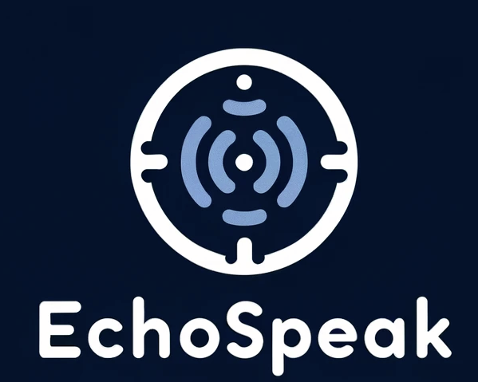

# EchoSpeak🗣️
> STT(✅) + LLM(not yet) + TTS engine for Korean Language


## Architechture


this project used pre trained korean model from byoussef's whisper-large-v2-ko model [](https://huggingface.co/byoussef/whisper-large-v2-Ko)


## version compatibility
```sh
python 3.10 +
cuda(11.7) or CPU or mps(m1 or m2)
```

## installation

It first requires the command-line tool ffmpeg to be installed on your system, which is available from most package managers:
```sh
# on Ubuntu or Debian
sudo apt update && sudo apt install ffmpeg

# on Arch Linux
sudo pacman -S ffmpeg

# on MacOS using Homebrew (https://brew.sh/)
brew install ffmpeg

# on Windows using Chocolatey (https://chocolatey.org/)
choco install ffmpeg

# on Windows using Scoop (https://scoop.sh/)
scoop install ffmpeg
```

### pytorch
```sh
pip install torch==2.0.1 torchvision==0.15.2 torchaudio==2.0.2
```

## requirements
```sh
openai-whisper==20231117
uvicorn==0.27.1
fastapi==0.109.2
```

## download models
```sh
clone git@github.com:kangmin5133/EcoSpeak.git
cd model
```
download pytorch_model.bin file from [here](https://huggingface.co/byoussef/whisper-large-v2-Ko/resolve/main/pytorch_model.bin?download=true)
after download, place pytorch_model.bin file to model directory


# Run
```sh
python main.py --port [your port]
```
